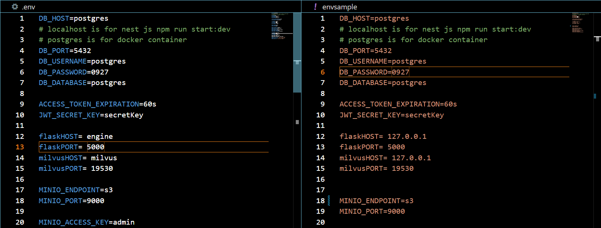
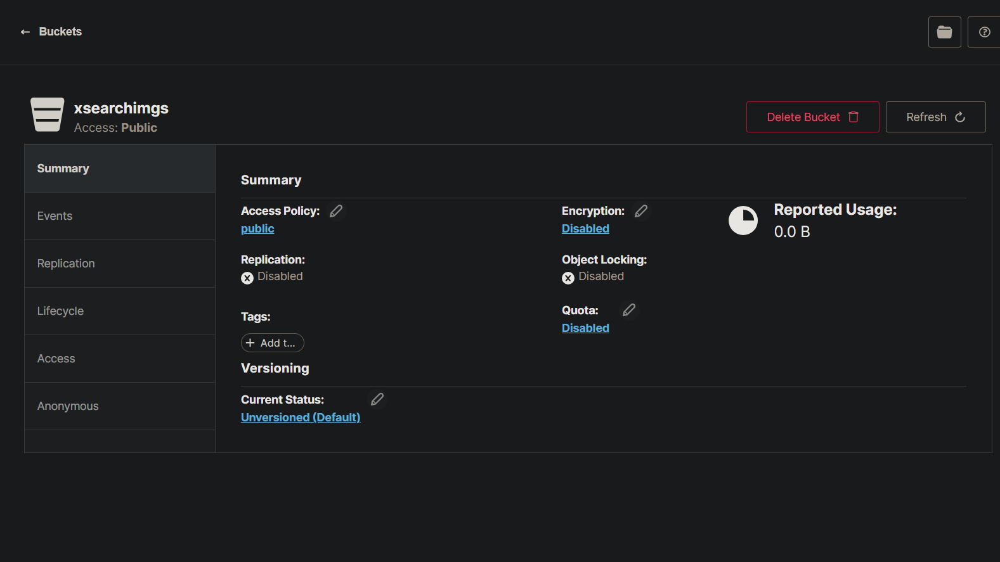
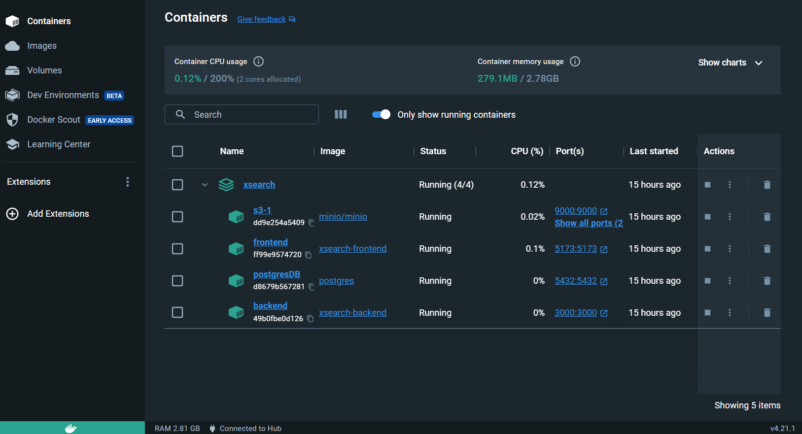

# Guide about Docker Compose

This guide illustrates how to use a xsearch using Docker Compose.

## Step 1: Make .env fie
If you don't have .env file or update that, you need to change the .env file where root directory

<p align="center">
 
</p>

## Step 2: Run Docker Compose

Start the Postgres and Minio services using Docker Compose. You can do this by entering the following command in your terminal:

```bash
docker-compose up -d
```


## Step 3: Make minio bucket

> **Note**: Minio does not support creating a bucket using Docker Compose. Therefore, before proceeding with this step, ensure that Access Policy option set public in Minio.

<p align="center">
 
</p>

# Now you can check docker desktop

<p align="center">
 
</p>

> **Notice**: we can not milvus and engine dockerize yet, as soon as possible we fix that

## Troubleshooting

If you encounter any issues with the connection, check and modify the access permissions of your Minio bucket, if necessary. If the issue persists, reach out to your supervisor or the person responsible for assistance.