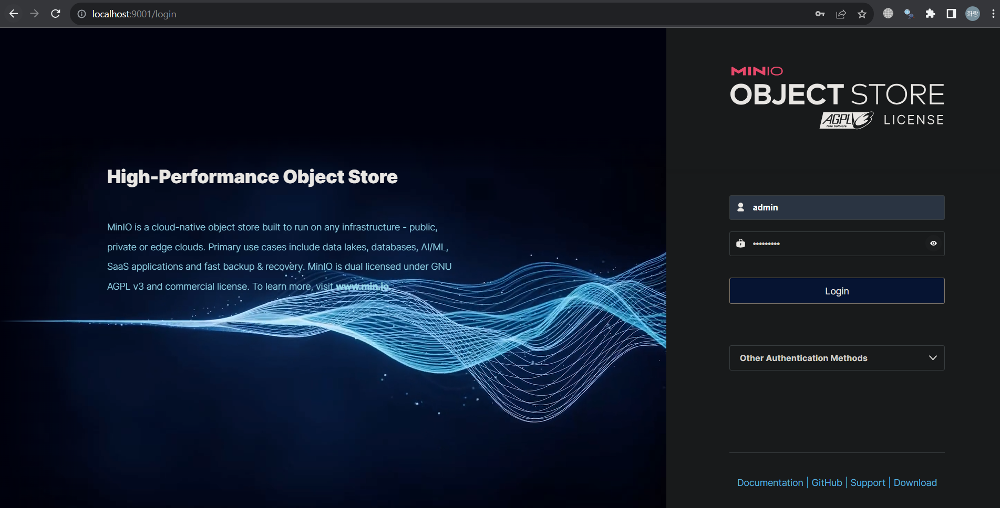

# 🔎 XSearch
XSearch는 제조 데이터 분석을 위한 유사 이미지 검색 엔진 서비스이다.   
사용자는 웹브라우저에 접속하여 손쉽게 서비스를 사용할 수 있다.

## 📋 Table of Contents
+ [About](#about)
+ [Architecture](#architecture)
  + [Frontend](#frontend---상세보기-wiki-페이지)
  + [Backend](#backend---상세보기-wiki-페이지)
  + [Engine](#engine---상세보기-wiki-페이지)
+ [Technology](#technology)

## 📁 About
XSearch는 사용자가 입력한 이미지 데이터와 유사한 이미지를 데이터셋에서 검색하여 웹브라우저로 보여준다.   
현장에서 작업자가 부품 및 자재에 대한 정보를 쉽게 찾을 수 있는 웹 서비스를 제공할 수 있다.

XSearch의 전체 구조 및 작동 방식은 다음과 같다.   


## 📚 Architecture

### 🌐 Frontend - [상세보기 wiki 페이지](https://github.com/korone00/xsearch/wiki/Architecture#frontend-%EC%A0%95%EC%9B%85-%EA%B0%80%EC%9D%80)
사용자가 접근할 수 있는 웹페이지를 제공한다.   
SveltKit과 Tailwind를 이용하여 제작하였다.
### 💾 Backend - [상세보기 wiki 페이지](https://github.com/korone00/xsearch/wiki/Architecture#backend)
사용자 정보 및 데이터셋에 대한 관리를 한다.    
NestJs를 이용하였고 Postgres DB와 Minio Storage를 함께 사용하였다.
### ⚡ Engine - [상세보기 wiki 페이지](https://github.com/korone00/xsearch/wiki/Architecture#engine)
이미지 데이터 셋을 Vectorize 및 Feature extraction을 진행하여 Vector DB에 저장한다. 사용자가 제공하는 이미지에 대해서도 똑같은 과정을 거쳐 유사한 이미지를 검색한다. Python과 Milvus DB, towhee Library를 사용하였다.
## 🔧 Technology - [상세보기 wiki 페이지](https://github.com/korone00/xsearch/wiki/Technology)
+ CI/CD using Docker and Github Action
+ JWT Auth process
+ Minio online storage for manage image dataset
+ Image Embedding process
+ Feature extraction using ResNet 50
+ Similar image search using L2
+ Statistics

## How to use

Docker-compose는 4단계 간단한 과정만 거치면 바로 사용하실 수 있습니다.

 Docker 설치:
   - Docker Hub 웹사이트: https://hub.docker.com/
   - 운영 체제(Windows, macOS, Linux)에 맞는 Docker를 다운로드하고 설치하세요.

## 1단계: .env 파일 만들기
.root 디렉토리에 .env 파일이 없거나 업데이트가 필요하면 .env 파일을 수정해야 합니다.

<p align="center">
 
</p>

> **Note**: Docker Compose에서 각 컨테이너의 이름을 Docker-compose.yml의 container_name으로 지정할 수 있습니다. 그러나 지정하지 않는 경우 localhost 또는 다른 IP 주소를 입력해야 합니다! 

## 2단계: Docker Compose 실행

터미널에서 xsearch 폴더에 들어간 다음 명령어를 입력하여 Postgres와 Minio 서비스를 Docker Compose를 사용하여 시작하세요

```bash
cd your-xsearch-path
docker-compose up -d
```

### 이 화면이 docker 컨테이너에 나타난다면 거의 성공했습니다!

<p align="center">
 
</p>

## 3단계: minio 접근키 만들기!
localhost:9011 혹은 지정한 IP adrress:9011에 접속 후 이 화면이 나올 것입니다.
<p align="center">
 
</p>

추가로 해 둔 설정이 없다면 id: admin, password:xsearchdbs일 것입니다.

<p align="center">
 
</p>

그 다음 access key를 만들어 주세요!
user, 1q2w3e4r로 설정해 주시면 됩니다.

## 4단계: 동작 확인하기
> **Notice**: 로컬호스트(또는 사용자가 설정한 호스트 => localhost)/(프론트엔드의 포트 설정 => 3000)에 접속하면 됩니다. 접속에 성공하신 다면 위 화면을 확인할 수 있습니다!

<p align="center">
 
</p>

## Troubleshooting
사용자가 코드를 수정하여 사용하고 싶다면


```
docker compose down
docker compose build
```
위 명령어를 실행한 후 다시 2단계로 가시면 됩니다!
만약 문제가 생긴다면 해당 관리자에게 문의하세요!

---
## Acknowledgement
```
["본 연구는 과학기술정보통신부 및 정보통신기획평가원의 SW전문인재양성사업의 연구결과로 수행되었음"(2022-0-01127) ]
```
