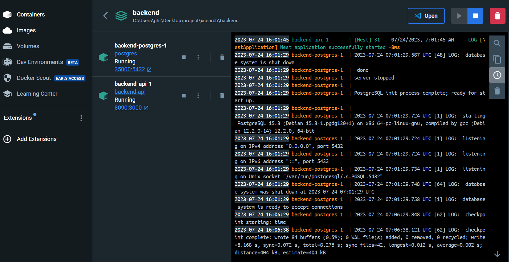
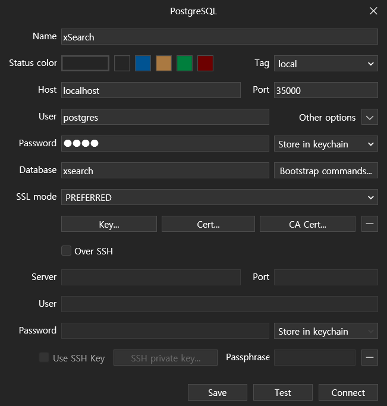

## Setting up the Development Environment

1. Install Docker:
   - Visit the Docker Hub website: https://hub.docker.com/
   - Download and install Docker for your operating system (Windows, macOS, or Linux).

### you can take a postgres images on this page
https://hub.docker.com/_/postgres?tab=tags

2. Clone the Project Repository:
   ```bash
   $ cd <your_project_directory>
   $ git clone <URL_that_you_clone>
   ```

3. Set up a PostgresSQL database with Docker:
   - Open a terminal and run the following commands:

     ```bash
     # Pull the official Postgres Docker image
     $ docker pull postgres
     ```

<p align="center">
 
</p>
If you, succeed you can check the postgres image in Docker desktop images
you can choose two options to make container


3-1. Click the run button, and you will check optional settings
|text|type|
|---|---|
|container name|postgres|
|Hostport|5432|
|Volumes Host Path|{path you want to}|
|Environment variables(Variables:Values)|POSTGRES_PASSWORD:1234|
|Environment variables(Variables:Values)|POSTGRES_DB:xsearch|
<p align="center">
 
</p>
Type the container name to postgres
Host
click the ImagesInto the 

### If you've been following along, you should have successfully created your container. 

this also two options to set up database

4-1. TablePlus(Recommended)
TablePlus : https://tableplus.com/
1. Create a new connection by clicking "Create a new connection" on the welcome screen of TablePlus.
2. Click "PostgreSQL" to select a PostgreSQL connection.
3. Set the connection details:

   - Name: An alias for the database connection (for example, "postgres").
   - Host: Hostname or IP address of the Postgres running in Docker (localhost)
   - Port: The port of the PostgreSQL running on (default: 5432)
   - User: The username (default: postgres)
   - Password: 0927.
   - Database: Name of the database to use

  After completing the settings, click the "Test" button to verify the connection, then click "Connect" to finalize the connection.
<p align="center">
 
</p>
this is a exam images

5. Install Postman:(don't need to do this)
   - Download and install Postman from: https://www.postman.com/downloads/

6. Test API using Postman:(don't need to do this)
   - Launch Postman and create a new request by clicking the "+" button at the top.
   - Choose the desired HTTP method and enter the API endpoint URL.
   - Configure any required authentication tokens, headers, etc., under the "Headers" tab.
   - If necessary, write the request body under the "Body" tab (e.g., for POST or PUT requests).
   - Click the blue "Send" button to send the request.
   - Check the response displayed in the panel below the request. If successful, you should receive a token.

7. Download Nest.js modules:
   ```bash
   $ npm install

   // If you occur problems in VS, Type below Scripts
   $ npm install --save @nestjs/typeorm typeorm
   $ npm install @types/hbs --save-dev
   $ npm install --save-dev @nestjs/testing
   $ npm install --save-dev @types/babel__core

   ```

## Running the Backend Server

To run the Nest.js backend server:
you need to run container actions, and npm run start.

# dotenv settings
If you don't have an .env file in a subdocument of the backend folder, create one and add an example like the following
```
DB_HOST=localhost
# postgres is for Docker container run
DB_PORT=5432
DB_USERNAME=postgres
DB_PASSWORD=0927
DB_DATABASE=xsearch

ACCESS_TOKEN_EXPIRATION=60s
JWT_SECRET_KEY=secretKey
```

<p align="center">
 
</p>

Your backend database server should now be up and running, and you can start developing and testing your application

***visit "localhost:3000/api"***

you can test database server and login, out, register etc...

```bash
# Development mode
$ npm run start

# Watch mode (for automatic restart on file changes)
$ npm run start:dev
```

# nestjs docker container 

If you want to create and use nestjs as an image on your docker desktop, follow the steps below

1. First, create a Dockerfile and a .dockerignore, docker-compose.yml file and fill in the contents below.

```
# Dockerfile
# Base image
FROM node:18

# Create app directory
RUN mkdir -p /var/app
WORKDIR /usr/src/app

# Bundle app source
COPY . .

# Install app dependencies
RUN npm install

# If you are using it for distribution, save it as a RUN npm ci.
# RUN npm ci

# Creates a "dist" folder with the production build
RUN npm run build

# Expose the port to run the application on
EXPOSE 3000

# Start the server using the production build
CMD [ "node", "dist/main.js" ]

```

```
# .dockerignore
.git
*Dockerfile*
node_modules
# npm-debug.log
# dist
# .dockerignore
```

```
# docker-compose.yml

version: '3.8'
services:
  api:
    build:
      dockerfile: Dockerfile
      context: .
    depends_on:
      - postgres
    volumes:
      - .:/usr/src/app
      - node-modules:/usr/src/app/node_modules
    environment: 
      POSTGRES_DB: ${DB_DATABASE}
      POSTGRES_USER: ${DB_USERNAME}
      POSTGRES_PASSWORD: ${DB_PASSWORD}
      POSTGRES_HOST: ${DB_HOST}
      POSTGRES_PORT: ${DB_PORT}
      DATABASE_URL: postgres://${DB_USER}:${DB_PASSWORD}@${POSTGRES_HOST}:${POSTGRES_PORT}/${DB_DATABASE}
      NODE_ENV: development
      PORT: 3000
    ports:
      - "${SERVER_PORT:-8090}:3000"
    command: npm run start:dev
  postgres:
    image: postgres
    environment:
      POSTGRES_DB: ${DB_DATABASE}
      POSTGRES_USER: ${DB_USER}
      POSTGRES_PASSWORD: ${DB_PASSWORD}
    ports:
      - '${DB_EXTERNAL_PORT:-35000}:5432'

volumes:
  node-modules:

```

and, you need to change 

2. And in the project root folder, type the above command 
```bash
$ docker-compose up -d
```
<p align="center">
 
</p>
you can check this iamge.

3. and you can get images and container
***visit "http://localhost:8090/api"***

and also you need to set new database
<p align="center">
 
</p>

you can also get swagger and page with out command npm run start:dev!

<p align="center">
 
</p>

you can check swagger at localhost:8090, not 3000!