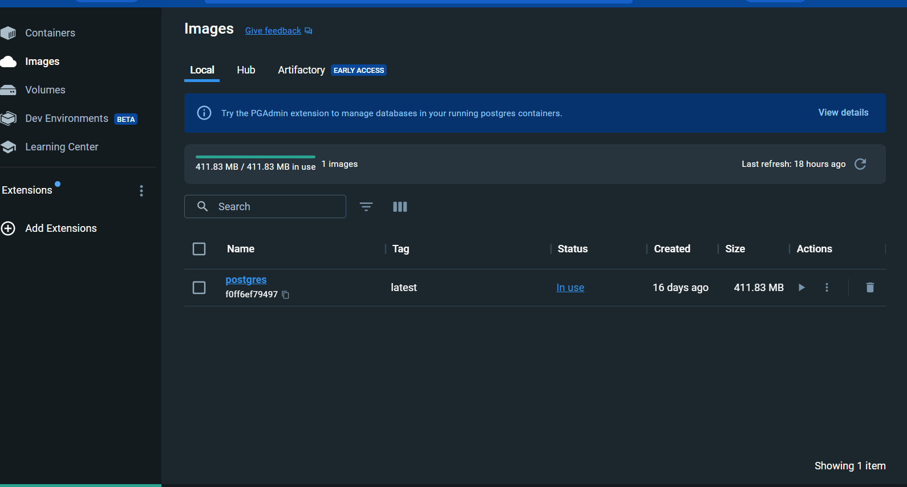
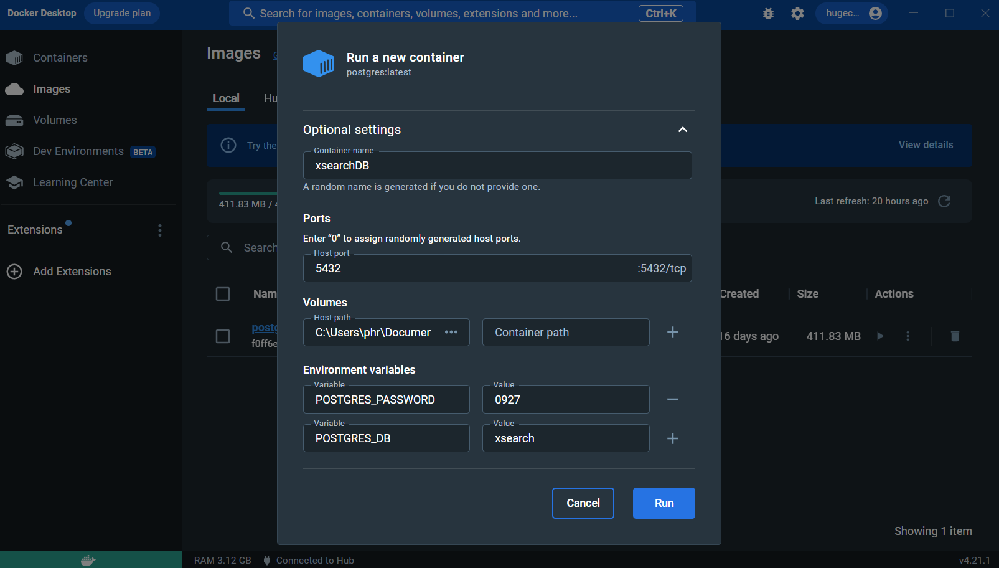
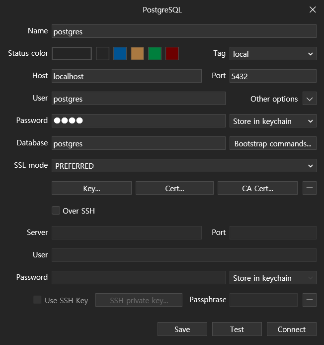
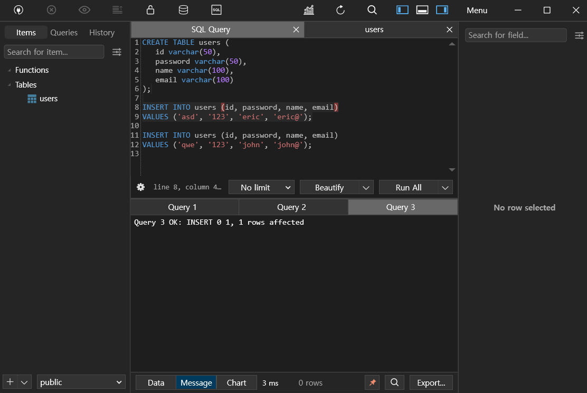
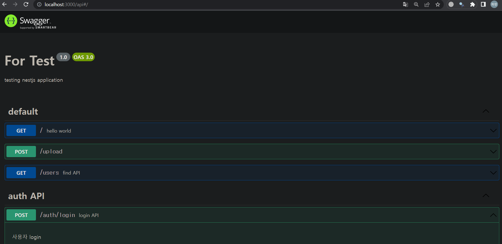

## Setting up the Development Environment

1. Install Docker:
   - Visit the Docker Hub website: https://hub.docker.com/
   - Download and install Docker for your operating system (Windows, macOS, or Linux).

### you can take a postgres images on this page
https://hub.docker.com/_/postgres?tab=tags

2. Clone the Project Repository:
   ```bash
   $ cd <your_project_directory>
   $ git clone <URL_that_you_clone>
   ```

3. Set up a PostgresSQL database with Docker:
   - Open a terminal and run the following commands:

     ```bash
     # Pull the official Postgres Docker image
     $ docker pull postgres
     ```

<p align="center">
 
</p>
If you, succeed you can check the postgres image in Docker desktop images
you can choose two options to make container

3-1.  command
     ```
     # Run a Postgres container with a custom name 'postgres', a password '1234',
     # and a mounted volume to persist data even after container shutdown
     $ docker run -d --name postgres -e POSTGRES_PASSWORD=1234 -p 5432:5432 -v pgdata:/var/lib/postgresql/data postgres
     ```


3-2. Click the run button, and you will check optional settings
|text|type|
|---|---|
|container name|postgres|
|Hostport|5432|
|Volumes Host Path|{path you want to}|
|Environment variables(Variables:Values)|POSTGRES_PASSWORD:1234|
|Environment variables(Variables:Values)|POSTGRES_DB:xsearch|
<p align="center">
 
</p>
Type the container name to postgres
Host
click the ImagesInto the 

### If you've been following along, you should have successfully created your container. 

this also two options to set up database

4-1. TablePlus(Recommended)
TablePlus : https://tableplus.com/
1. Create a new connection by clicking "Create a new connection" on the welcome screen of TablePlus.
2. Click "PostgreSQL" to select a PostgreSQL connection.
3. Set the connection details:

   - Name: An alias for the database connection (for example, "postgres").
   - Host: Hostname or IP address of the Postgres running in Docker (localhost)
   - Port: The port of the PostgreSQL running on (default: 5432)
   - User: The username (default: postgres)
   - Password: 0927.
   - Database: Name of the database to use

  After completing the settings, click the "Test" button to verify the connection, then click "Connect" to finalize the connection.
<p align="center">
 
</p>
this is a exam images

<p align="center">
 
</p>
and run all this query, if you are succeed, you are going to connect nest js web


4-2. Database command:I(don't need to do this)
   - Connect to the PostgreSQL container:

     ```bash
     $ docker exec -it postgres psql -U postgres
     ```

   - Inside the PostgreSQL interactive shell, create a new database and table:

     ```sql
     CREATE DATABASE pg_database;
     \c pg_database;
     CREATE TABLE user (
       id varchar(50),
       password varchar(50),
       name varchar(100),
       email varchar(100)
     );

     INSERT INTO user (id, password, name, email)
     VALUES ('asd', '123', 'eric', 'eric@');
     INSERT INTO user (id, password, name, email)
     VALUES ('qwe', '123', 'john', 'john@');
     ```

5. Install Postman:(don't need to do this)
   - Download and install Postman from: https://www.postman.com/downloads/

6. Test API using Postman:(don't need to do this)
   - Launch Postman and create a new request by clicking the "+" button at the top.
   - Choose the desired HTTP method and enter the API endpoint URL.
   - Configure any required authentication tokens, headers, etc., under the "Headers" tab.
   - If necessary, write the request body under the "Body" tab (e.g., for POST or PUT requests).
   - Click the blue "Send" button to send the request.
   - Check the response displayed in the panel below the request. If successful, you should receive a token.

7. Download Nest.js modules:
   ```bash
   $ npm install

   // If you occur problems in VS, Type below Scripts
   $ npm install --save @nestjs/typeorm typeorm
   $ npm install @types/hbs --save-dev
   $ npm install --save-dev @nestjs/testing
   $ npm install --save-dev @types/babel__core

   ```

## Running the Backend Server

To run the Nest.js backend server:
you need to run container actions, and npm run start.
and visit localhost:3000/api, you can test database server and login, out, register etc...

```bash
# Development mode
$ npm run start

# Watch mode (for automatic restart on file changes)
$ npm run start:dev
```
<p align="center">
 
</p>


Your backend database server should now be up and running, and you can start developing and testing your application

# dotenv settings
If you don't have an .env file in a subdocument of the backend folder, create one and add an example like the following
```
DB_HOST=localhost
DB_PORT=5432
DB_USERNAME=postgres
DB_PASSWORD=0927
DB_DATABASE=xsearch

ACCESS_TOKEN_EXPIRATION=60s
JWT_SECRET_KEY=secretKey
```