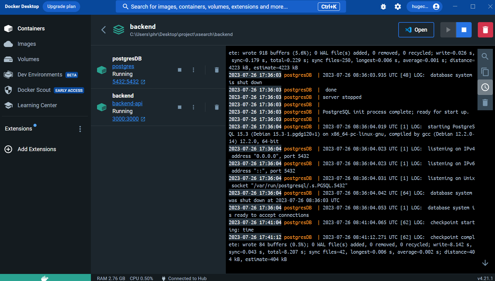
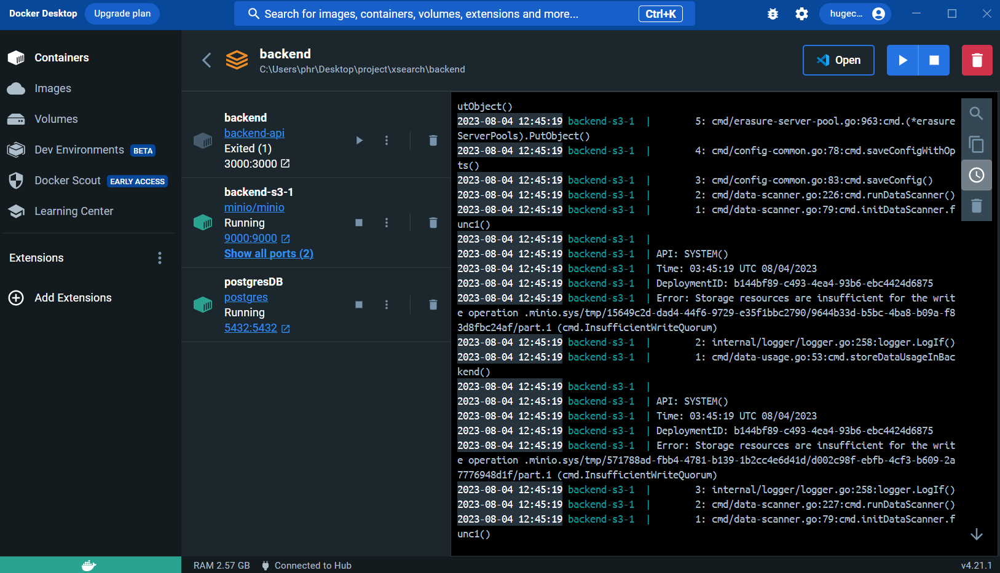
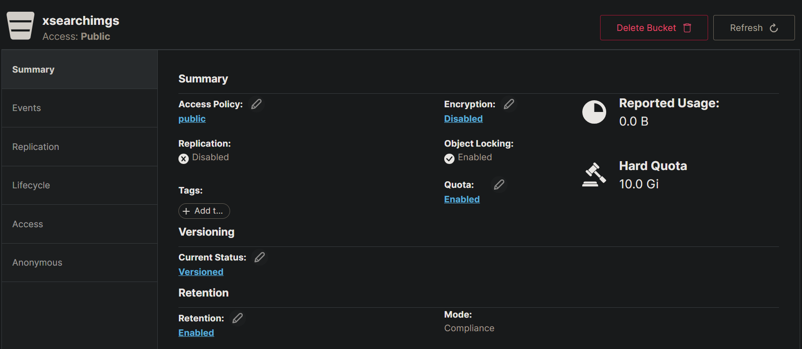
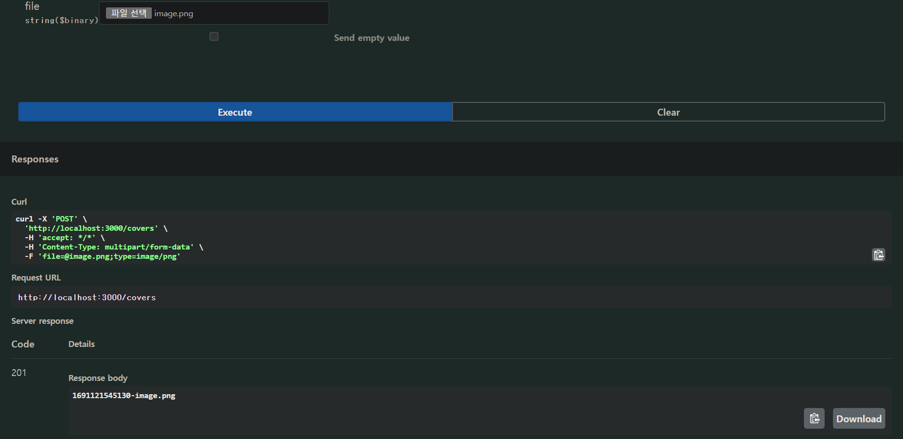
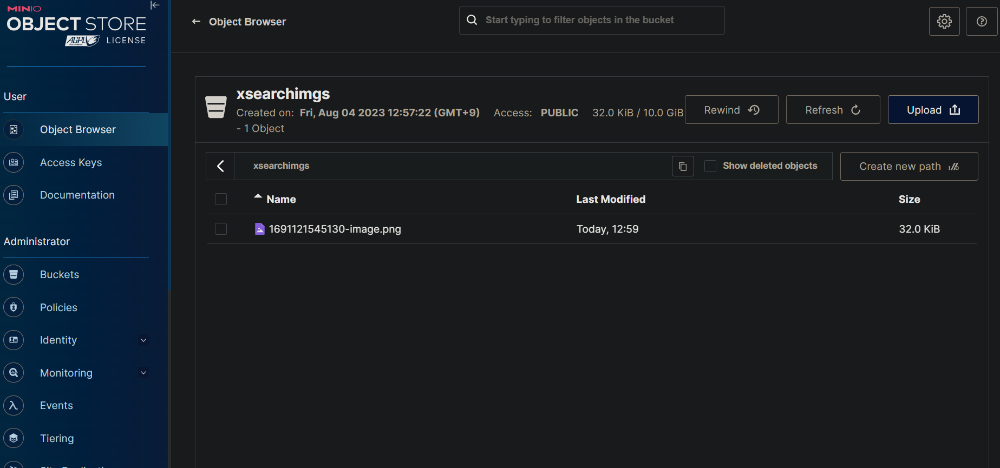

# Welcome to backend setting! this is easier than you think!

## Setting up the Development Environment

1. Install Docker:
   - Visit the Docker Hub website: https://hub.docker.com/
   - Download and install Docker for your operating system (Windows, macOS, or Linux).

### you can take a postgres images on this page
https://hub.docker.com/_/postgres?tab=tags

2. Clone the Project Repository:
   ```bash
   $ cd <your_project_directory>
   $ git clone <URL_that_you_clone>
   ```

3. Set up a PostgresSQL database with Docker:
   - Open a terminal and run the following commands:

     ```bash
     # Pull the official Postgres Docker image
     $ docker pull postgres
     ```

<p align="center">
 
</p>
If you, succeed you can check the postgres image in Docker desktop images
you can choose two options to make container


3-1. Click the run button, and you will check optional settings
|text|type|
|---|---|
|container name|postgres|
|Hostport|5432|
|Volumes Host Path|{path you want to}|
|Environment variables(Variables:Values)|POSTGRES_PASSWORD:1234|
|Environment variables(Variables:Values)|POSTGRES_DB:xsearch|
<p align="center">
 
</p>
Type the container name to postgres
Host
click the ImagesInto the 

### If you've been following along, you should have successfully created your container. 

this also two options to set up database

4-1. TablePlus(Recommended)
TablePlus : https://tableplus.com/
1. Create a new connection by clicking "Create a new connection" on the welcome screen of TablePlus.
2. Click "PostgreSQL" to select a PostgreSQL connection.
3. Set the connection details:

   - Name: An alias for the database connection (for example, "postgres").
   - Host: Hostname or IP address of the Postgres running in Docker (localhost)
   - Port: The port of the PostgreSQL running on (default: 5432)
   - User: The username (default: postgres)
   - Password: 0927
   - Database: Name of the database to use

  After completing the settings, click the "Test" button to verify the connection, then click "Connect" to finalize the connection.
<p align="center">
 
</p>
this is a exam images

5. Install Postman:(don't need to do this)
   - Download and install Postman from: https://www.postman.com/downloads/

6. Test API using Postman:(don't need to do this)
   - Launch Postman and create a new request by clicking the "+" button at the top.
   - Choose the desired HTTP method and enter the API endpoint URL.
   - Configure any required authentication tokens, headers, etc., under the "Headers" tab.
   - If necessary, write the request body under the "Body" tab (e.g., for POST or PUT requests).
   - Click the blue "Send" button to send the request.
   - Check the response displayed in the panel below the request. If successful, you should receive a token.

7. Download Nest.js modules:
   ```bash
   $ npm install

   // If you occur problems in VS, Type below Scripts
   $ npm install --save @nestjs/typeorm typeorm
   $ npm install @types/hbs --save-dev
   $ npm install --save-dev @nestjs/testing
   $ npm install --save-dev @types/babel__core

   ```

## Running the Backend Server

To run the Nest.js backend server:
you need to run container actions, and npm run start.

# dotenv settings
If you don't have an .env file in a subdocument of the backend folder, create one and add an example like the following
```
DB_HOST=localhost
# localhost is for nest js npm run start:dev
# postgres is for docker container
DB_PORT=5432
DB_USERNAME=postgres
DB_PASSWORD=0927
DB_DATABASE=xsearch

ACCESS_TOKEN_EXPIRATION=60s
JWT_SECRET_KEY=secretKey
```

<p align="center">
 
</p>

Your backend database server should now be up and running, and you can start developing and testing your application

***visit "localhost:3000/api"***

you can test database server and login, out, register etc...

```bash
# Development mode
$ npm run start

# Watch mode (for automatic restart on file changes)
$ npm run start:dev
```

# nestjs docker container 

and, you need to change 

2. And in the project root folder, type the above command 
```bash
$ docker-compose up -d
# IF you want to delete cash, because you adjust package, type docker-compose build --no-cache
```

you can check this image in docker desktop.

<p align="center">
 
</p>

3. and you can get images and container
***visit "http://localhost:3000/api"***

and also you need to set new database

<p align="center">
 
</p>

you can also get swagger and page with out command npm run start:dev!

you can check swagger at localhost:8090, not 3000!


# Guide to Connect NestJS with Docker Compose

This guide illustrates how to connect a NestJS application with Postgres and Minio services using Docker Compose.

## Step 1: Run Docker Compose

Start the Postgres and Minio services using Docker Compose. You can do this by entering the following command in your terminal:

```bash
docker-compose up -d
```
<p align="center">
 
</p>
## Step 2: Launch NestJS

Next, launch the NestJS application. 

> **Note**: Minio does not support creating a bucket using Docker Compose. Therefore, before proceeding with this step, ensure that a bucket is already created in Minio.

<p align="center">
 
</p>

## Step 3: Verification via Swagger API

To verify if NestJS is running and connecting properly, use the Swagger API. Through this, you can check if uploaded images are displayed correctly.

<p align="center">
 
</p>

you can also check on minio api
<p align="center">
 
</p>

## Troubleshooting

If you encounter any issues with the connection, check and modify the access permissions of your Minio bucket, if necessary. If the issue persists, reach out to your supervisor or the person responsible for assistance.

Through these steps, you can connect your NestJS application with Postgres and Minio services using Docker Compose. We hope this guide is helpful to you!

# Description of the backend API in Swagger

## default API 

### /image/covers(Post)
you can upload file if mimetype of the file is jpg|jpeg|png|gif. If you upload file with 'try it out' button,
you can check the uploaded file in your minio bucket. and if file uploaded in your minio bucket, minio will send url transformed uuid.
Multer is a Node. js middleware for handling multipart/form-data that makes the otherwise painstaking process of uploading files in Node. js much easier. 
multer helps you receive files from the front end, save them, and upload them to the backend.
Through the minioService, If there is no bucket in minio, first create a bucket through the 'createBucketIfNotExists' method and then upload the file. When minio converts the uuid of the uploaded file to url and returns it to the backend, it saves it to 'img_path' and sends 'img_path' to flask. 

### /image/data(Post)
The API can store file data using the class rawDataService's saveData and receive the url of the file through the minioService.getFileUrl function.

### /image/covers/{filename}(Delete)

you can delete the file at 'Delete:/covers/{filename}'through the minioService.deleteFile function.

## auth API

### /auth/login(Post)

users can log in to the Xsearch page with this API.
When a user enters an ID and password, an ID in the registered member information and a token are sent if it matches the password. This API checks the user repository for membership through the validateUser function of authservice, which is a class, checks the hash functioned password through bcrypt as a matching function, and checks whether the IDs match. If the registered member information matches the entered information, the jwt access token is issued through the login function.

### /auth/register(Post)

This API allows a user to register user information and checks for duplicate members and stores user information through the class UserService.
### /auth/logout(Post)

This API logs the user out of the page.
The @ApiBearAuth() decorator was used to allow token authentication to proceed. When you set up the decorator @ApiBearAuth ('access-token') , the API must send JWT token information together. When logging out, res.cookie was used to store the jwt token value in cookies, and the expiration date was set to 0 through maxage.

### /auth/profile(Get)

This API retrieves user information.

### /auth/profile2(Get)

This API retrieves userID through getUser of authService class.

### /auth/users(Get)

This API retrieves Full list of users(only for Admin).

### /auth/delete(Post)

This API deletes the id that exists in the user repository through the deleteUser function of authservice when you enter the user ID and password.

### /auth/modify(Put)

This API finds user information in the repository through the user ID and stores newinfo to return the modified user information.
