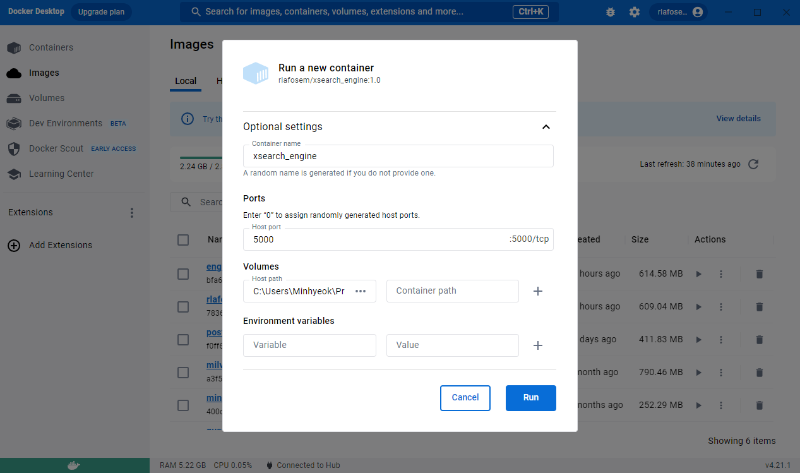
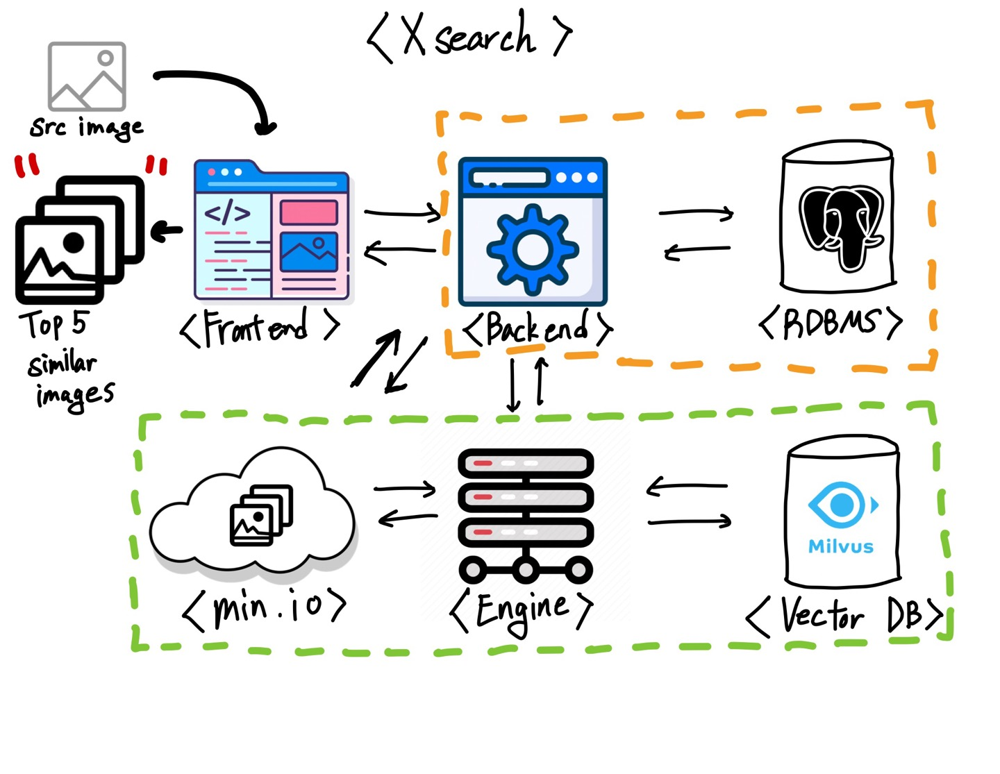
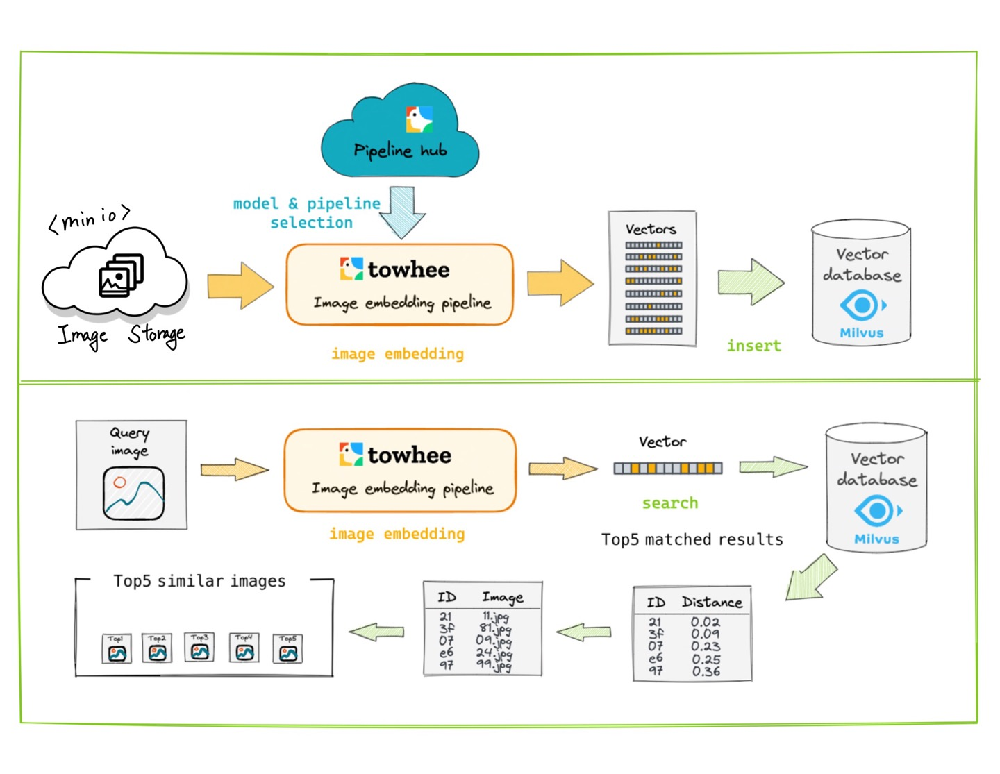

<p align="center">
  <a href="https://github.com/korone00/xsearch" rel="noopener">
    
  </a>
</p>
<h1 align="center">XSearch_engine</h1>

<div align="center">

[](https://github.com/korone00/xsearch)
[](https://github.com/korone00/xsearch/issues)
[](https://github.com/korone00/xsearch/pulls)
[](/LICENSE)

</div>

---

<p align="center"> We can find the image you want.
    <br>
</p>

## 📝 Table of Contents

- [About](#about)
- [Getting Started](#getting_started)
- [Deployment](#deployment)
- [Usage](#usage)
- [Built Using](#built_using)
- [TODO](../TODO.md)
- [Contributing](../CONTRIBUTING.md)
- [Authors](#authors)
- [Acknowledgments](#acknowledgement)

## 🧐 About <a name = "about"></a>

Find similar images on the web. It works with Milvus DB and is easy to start with a docker image.

## 🏁 Getting Started <a name = "getting_started"></a>

These instructions will get you a copy of the project up and running on your local machine for development and testing purposes. See [deployment](#deployment) for notes on how to deploy the project on a live system.

### Prerequisites

#### 1. Install Docker

- Visit the Docker Hub website: <https://hub.docker.com/>
  - Download and install Docker for your operating system (Windows, macOS, or Linux).

#### you can take a xsearch_engine images on this page

<https://hub.docker.com/r/rlafosem/xsearch_engine/tags>

#### 2. Set up a Milvus DB images with Docker

- Open a terminal and run the following commands:
  - Make a directory

      ```bash
      cd <your_project_directory>
      ```

  - Docker image download

      ```bash
      curl -LJO https://github.com/milvus-io/milvus/releases/download/v2.2.10/milvus-standalone-docker-compose.yml
      ```

  - Rename docker image

      ```bash
      rename milvus-standalone-docker-compose.yml docker-compose.yml
      ```

  - Add milvus container

      ```bash
      docker-compose up
      ```

  - Install milvus

      ```bash
      python -m pip install -q pymilvus==2.2.11
      ```

#### 3. Set up a Xsearch_engine imageswith Docker

- Open a terminal and run the following commands:

     ```bash
     # Pull the Xsearch_engine Docker image
     $ docker pull rlafosem/xsearch_engine:latest
     ```

### Installing

If you, succeed you can check the rlafosem/xserach_engine image in Docker desktop image
you can choose two options to make container

#### 3-1. Use CLI
     ```
     $ docker run -d --name xsearh_engine -p 5000:5000 rlafosem/xsearch_engine:latest
     ```


#### 3-2. Use Docker Desktop
|text|type|
|---|---|
|container name|xsearch_engine|
|Hostport|5000|
|Volumes Host Path|{path you want to}|

<p align="center">
 
</p>

Set options and RUN

### If you've been following along, you should have successfully created your container.

------------------------------------------------------------------------------
작성중...
## 🔧 What is the Xsearch <a name = "Strunctures"></a>

Xsearch is a service that allows users to upload an image in a web browser and find 5 similar images based on artificial intelligence. The overall structure of Xsearch is as follows.




The structure of Xsearch's engine is as follows
Store the source image provided by the user in min.io storage. The engine fetches the source image, embeds it, and returns the information of five similar photos from the Milverse DB. The engine provides this information to min.io, which in turn returns the photos to the backend server for display on the frontend.

Here's how the engine works



Put the image provided by min.io into the towhee pipeline.   
As the image goes through the towhee pipeline, it is processed using the methods provided in the pipeline hub.   
The first step is to decode the image. Photos with different extensions are converted into vectors with three layers (R, G, B).

The next step is image embedding. A pre-trained model provided by TIMM is used to extract features from the image. The model used is 'ResNet50'.
After leaving the pipeline, the photo image is converted into an embedding vector.
This embedding vector enters another TOWHEE pipeline and is stored in the Milverse DB.
After this process, the image is ready for similarity search.

Now let's look at the bottom part of the figure. Here's how it works.    
When a user provides a query image, it is stored in min.io and received by the engine.    
Then, as you can see, the image is embedded. The embedded vector goes into the Milverse DB, and you can easily find similar vectors using the methods provided in Milverse.    
We print it back out and we're done.


### Break down into end to end tests

Explain what these tests test and why

```
Give an example
```

### And coding style tests

Explain what these tests test and why

```
Give an example
```

## 🎈 Usage <a name="usage"></a>

Add notes about how to use the system.

## 🚀 Deployment <a name = "deployment"></a>

Add additional notes about how to deploy this on a live system.

## ⛏️ Built Using <a name = "built_using"></a>

- [MongoDB](https://www.mongodb.com/) - Database
- [Express](https://expressjs.com/) - Server Framework
- [VueJs](https://vuejs.org/) - Web Framework
- [NodeJs](https://nodejs.org/en/) - Server Environment

## ✍️ Authors <a name = "authors"></a>

- [@kylelobo](https://github.com/kylelobo) - Idea & Initial work

See also the list of [contributors](https://github.com/kylelobo/The-Documentation-Compendium/contributors) who participated in this project.

## 🎉 Acknowledgements <a name = "acknowledgement"></a>

- Hat tip to anyone whose code was used
- Inspiration
- References
