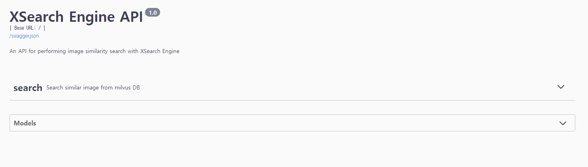
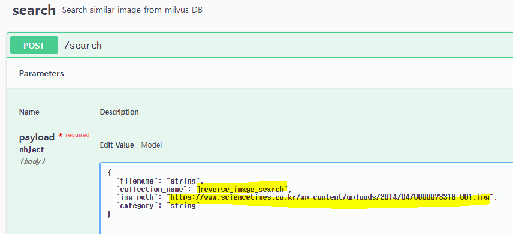
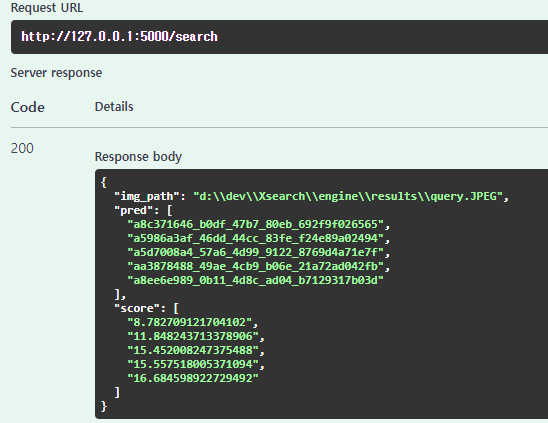

# Engine install process
## 1. Docker install
- Visit the Docker Hub website: <https://hub.docker.com/>
  - Download and install Docker for your operating system (Windows, macOS, or Linux).
  
#### you can take a xsearch_engine images on this page

<https://hub.docker.com/r/rlafosem/xsearch_engine/tags>
## 2. milvus container install
- Open a terminal and run the following commands:
  - Make a directory

      ```bash
      cd <your_project_directory>
      ```

  - Docker image download

      ```bash
      curl -LJO https://github.com/milvus-io/milvus/releases/download/v2.2.10/milvus-standalone-docker-compose.yml
      ```

  - Rename docker image

      ```bash
      rename milvus-standalone-docker-compose.yml docker-compose.yml
      ```

  - Add milvus container

      ```bash
      docker-compose up
      ```

  - Install milvus

      ```bash
      python -m pip install -q pymilvus==2.2.11
      ```

## 3. minio container install
```bash
$ docker-compose -f docker-compose.yml up -d
```
download the min.io yml files for docker.

```
pip install minio
```
download python package for min.io

### 3.1 access minIO server

http://localhost:9000


### 3.2 login id and password

id and password is in docker-compose.yml
At first, you enter the id and password directly.

### 3.3 create access key and secret key
To upload and access the images in min.io, you create access key and secret key.
The access key and secret key should be set as environmental variables in .env.
(You can create your own .env file by referring to the env.sample file.)
## 4. run dataset.py
When you run the dataset.py script, you'll see a reverse_image_search directory and a log directory created.
## 5. run main.py
When you run the main.py script, a flask server connection window will appear in the terminal window. If you connect to 172.0.0.1:5000, you can see the swagger ui.

## 6. post requests
When you connect to the SEARCH endpoint in the SWAGGER UI, you can enter JSON. If you set collection_name='reverse_image_search', img_path='url' and execute, you can see that the minio_id value is returned.